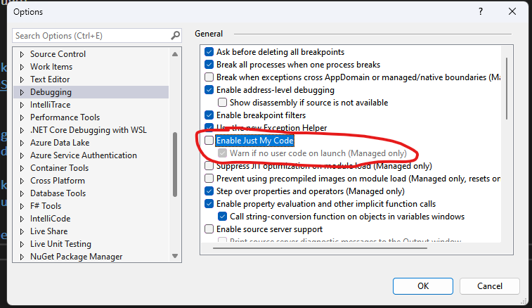
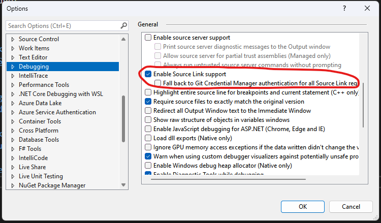
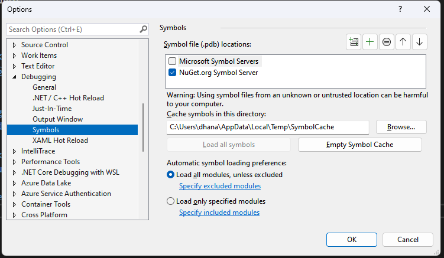
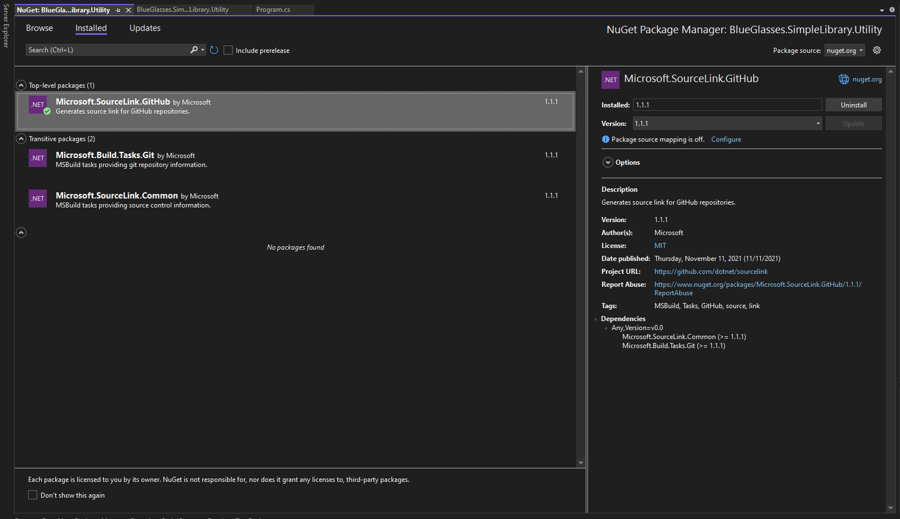

# BlueGlasses.SimpleLibrary

## Utility Library


Merupakan library contoh untuk penggunaan source link. Dapat diunduh pada link berikut: [Nuget Package](https://www.nuget.org/packages/BlueGlasses.SimpleLibrary.Utility)

## Source Link Tutorial

Step Source Link:

1. Nyalakan debugging tools, Tools > Options > Debugging: 
  - Pada tab General: matikan "Enable Just My Code", lalu nyalakan "Enable Source Link Support"
  
  
  - Pada tab Symbols: tambah symbol server yang menjadi sumber artifak
  
  - sumber: https://endjin.com/blog/2022/05/debugging-nuget-packages-understanding-debugging-symbols-and-using-source-link

2. Pada class library, tambahkan package Source Link supaya dapat link antara nuget package dengan source code. Sebagai contoh: Microsoft.SourceLink.Github jika anda menggunakan github


3. Tambahkan beberapa metadata yang diperlukan pada file .csproj dari class library, best practice dapat dilihat pada halaman berikut: https://learn.microsoft.com/en-us/nuget/create-packages/package-authoring-best-practices

4. Pastikan project akan membuat symbol package berformat .snupkg, setelan ini dapat ditambahkan sebagai berikut:

```xml
<PropertyGroup>
  <IncludeSymbols>True</IncludeSymbols>
  <SymbolPackageFormat>snupkg</SymbolPackageFormat>
</PropertyGroup>
```

5. Jika anda tidak menggunakan CI/CD, beberapa hal yang harus diperhatikan:
  - push source code terbaru dari class library ke repository sebelum melakukan pack
  - clean project
  - build project
  - pack project
  - file .nupkg dan .snupkg siap di upload